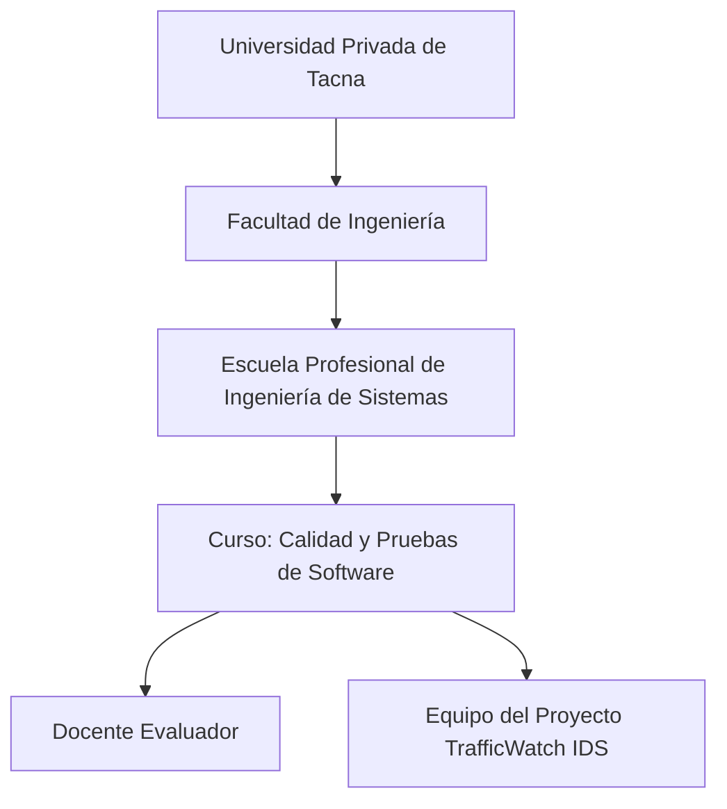
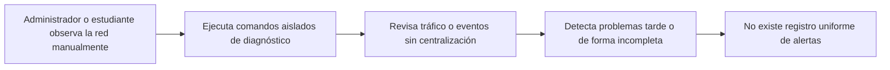
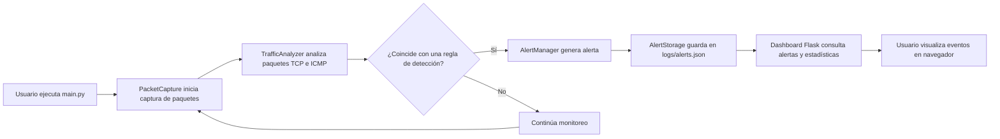
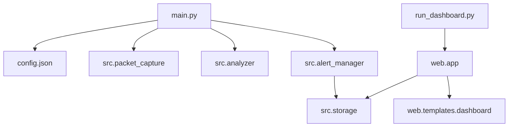
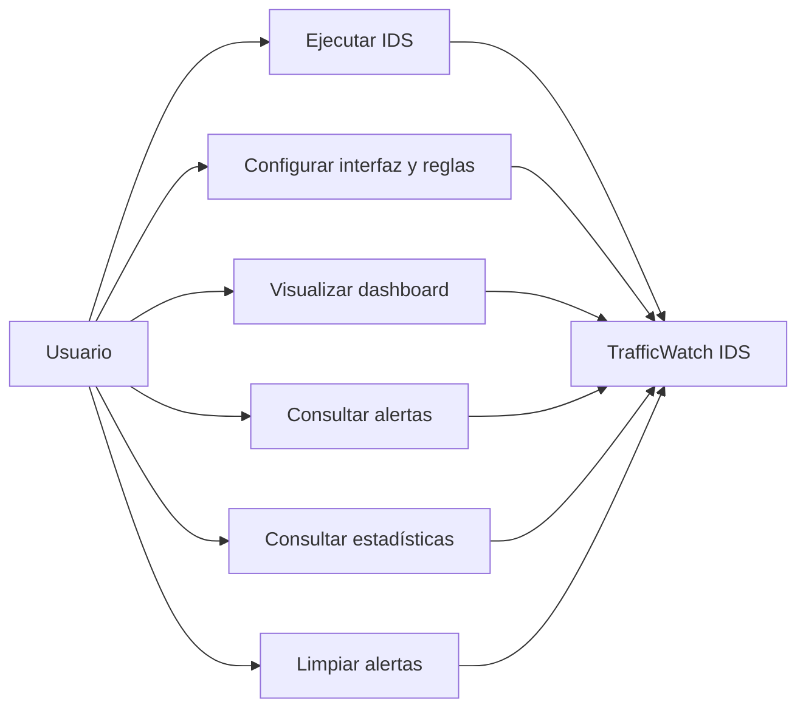
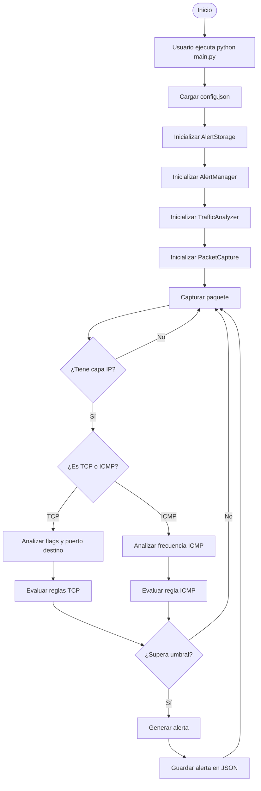
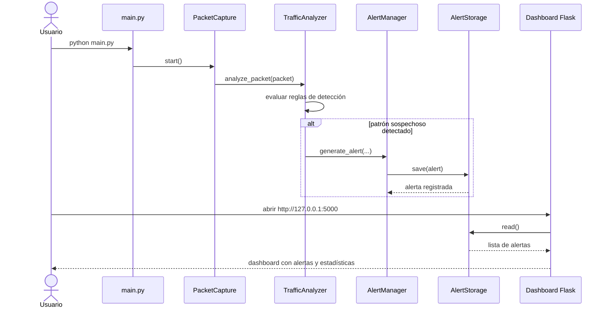
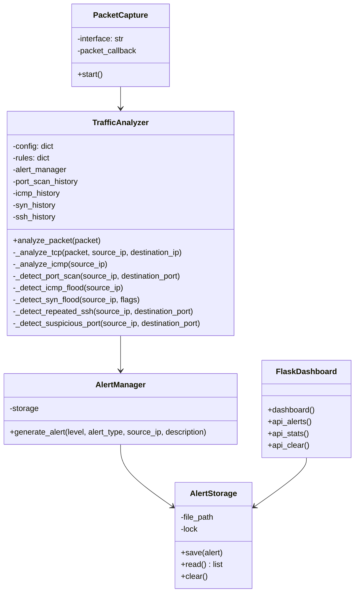

**UNIVERSIDAD PRIVADA DE TACNA**

**FACULTAD DE INGENIERÍA**

**Escuela Profesional de Ingeniería de Sistemas**

**Proyecto *TrafficWatch IDS***

Curso: *Calidad y Pruebas de Software*

Docente: *Patrick Cuadros Quiroga*

Integrantes:

***Edgar Diego Chara Apaza        (2019065026)***  
***Abel Fernando Pacompía Ortiz   (2023076797)***

**Tacna – Perú**

***2026***

\pagebreak

Sistema *Desarrollo de un sistema de detección de intrusos (IDS) para monitoreo de tráfico de red*

Informe de Especificación de Requerimientos

Versión *1.0*

| CONTROL DE VERSIONES |           |              |               |            |                                      |
|:--------------------:|:----------|:-------------|:--------------|:-----------|:-------------------------------------|
|       Versión        | Hecha por | Revisada por | Aprobada por  | Fecha      | Motivo                               |
|         1.0          | APO, ECA  | APO, ECA     | P. Cuadros Q. | 2026-04-28 | Versión inicial del documento        |
|         1.1          | APO, ECA  | APO, ECA     | P. Cuadros Q. | 2026-05-01 | Realización del documento |

# ÍNDICE GENERAL

1. [Introducción](#1-introducción)
2. [Generalidades de la Empresa](#2-generalidades-de-la-empresa)
    1. [Nombre de la Empresa](#21-nombre-de-la-empresa)
    2. [Visión](#22-visión)
    3. [Misión](#23-misión)
    4. [Organigrama](#24-organigrama)
3. [Visionamiento de la Empresa](#3-visionamiento-de-la-empresa)
    1. [Descripcion del problema](#31-descripcion-del-problema)
    2. [Objetivo de Negocios](#32-objetivo-de-negocios)
    3. [Objetivo de diseño](#33-objetivo-de-diseño)
    4. [Alcance del proyecto](#34-alcance-del-proyecto)
    5. [Viabilidad del sistema](#35-viabilidad-del-sistema)
    6. [Informacion obtenida del Levantamiento de informacion](#36-informacion-obtenida-del-levantamiento-de-informacion)
4. [Analisis de procesos](#4-analisis-de-procesos)
    1. [Diagrama de Procesos Actual](#41-diagrama-de-procesos-actual)
    2. [Diagrama de Procesos Propuesto](#42-diagrama-de-procesos-propuesto)
5. [Especificacion de Requerimientos de Software](#5-especificacion-de-requerimientos-de-software)
    1. [Cuadro de Requerimientos funcionales Inicial](#51-cuadro-de-requerimientos-funcionales-inicial)
    2. [Cuadro de Requerimientos no funcionales](#52-cuadro-de-requerimientos-no-funcionales)
    3. [Cuadro de Requerimientos funcionales Final](#53-cuadro-de-requerimientos-funcionales-final)
    4. [Regla de Negocio](#54-regla-de-negocio)
6. [Fase de Desarrollo](#6-fase-de-desarrollo)
    1. [Perfil del Usuario](#61-perfil-del-usuario)
    2. [Modelo Conceptual](#62-modelo-conceptual)
        1. [Diagrama de paquetes](#621-diagrama-de-paquetes)
        2. [Diagrama de casos de uso](#622-diagrama-de-casos-de-uso)
        3. [Escenarios de casos de uso (narrativas)](#623-escenarios-de-casos-de-uso-narrativas)
    3. [Modelo Lógico](#63-modelo-lógico)
        1. [Analisis de Objetos](#631-analisis-de-objetos)
        2. [Diagrama de Actividades con objetos](#632-diagrama-de-actividades-con-objetos)
        3. [Diagrama de secuencia](#633-diagrama-de-secuencia)
        4. [Diagrama de clases](#634-diagrama-de-clases)
7. [Conclusiones](#7-conclusiones)
8. [Recomendaciones](#8-recomendaciones)
9. [Bibliografia](#9-bibliografia)
10. [Webgrafia](#10-webgrafia)

\pagebreak

# 1. Introducción

El presente Informe de Especificación de Requerimientos de Software (ERS) define las funcionalidades y características del sistema TrafficWatch IDS, orientado al monitoreo de tráfico de red en tiempo real para la detección de intrusos.

El sistema permite capturar paquetes de red, analizarlos y detectar comportamientos sospechosos como escaneo de puertos, ataques SYN flood e ICMP flood, generando alertas que pueden ser visualizadas mediante un dashboard web.

Este documento asegura la trazabilidad entre los requerimientos, la implementación y las pruebas del sistema desarrollado en el marco del curso Calidad y Pruebas de Software..

# 2. Generalidades de la Empresa

## 2.1 Nombre de la empresa

Universidad Privada de Tacna – Facultad de Ingeniería – Escuela Profesional de Ingeniería de Sistemas.

## 2.2 Visión

Ser un equipo académico capaz de proponer soluciones tecnológicas útiles, seguras y aplicables a entornos reales, fortaleciendo el aprendizaje en ingeniería de software, redes y ciberseguridad mediante proyectos prácticos y verificables.

## 2.3 Misión

Desarrollar un sistema IDS funcional que permita monitorear tráfico de red, identificar comportamientos sospechosos y generar alertas comprensibles, aplicando buenas prácticas de análisis, diseño, implementación y pruebas dentro del curso de Calidad y Pruebas de Software.

## 2.4 Organigrama

# 3. Visionamiento de la Empresa

## 3.1 Descripción del problema

En los entornos de red, la falta de monitoreo continuo puede ocasionar que actividades sospechosas pasen desapercibidas. Ataques o comportamientos como escaneos de puertos, envío masivo de paquetes ICMP, múltiples paquetes SYN o intentos repetidos hacia servicios sensibles pueden representar señales tempranas de intrusión o reconocimiento malicioso.

En muchos laboratorios académicos o redes pequeñas no se cuenta con una herramienta accesible que permita observar este tipo de eventos en tiempo real. Esto limita la capacidad de análisis, aprendizaje y respuesta frente a incidentes básicos de seguridad de red.

Por ello, se propone el desarrollo de *TrafficWatch IDS*, un sistema de detección de intrusos orientado a capturar tráfico, analizar paquetes y generar alertas cuando se identifiquen patrones anómalos o potencialmente peligrosos.

## 3.2 Objetivo de Negocios

Reducir el riesgo de incidentes de seguridad en redes controladas mediante la detección temprana de comportamientos sospechosos, proporcionando una herramienta académica que permita monitorear tráfico, generar alertas y visualizar eventos de seguridad de forma comprensible.

## 3.3 Objetivo de diseño

Diseñar e implementar un sistema IDS básico, modular y configurable en Python que:

- capture paquetes de red en tiempo real;
- analice tráfico TCP e ICMP;
- detecte escaneo de puertos, *SYN flood*, *ICMP flood*, intentos repetidos SSH y uso de puertos sospechosos;
- registre alertas en formato JSON;
- y permita visualizar estadísticas y eventos mediante un dashboard web.

## 3.4 Alcance del proyecto

**Incluido en la versión actual:**

- Captura de paquetes de red usando *Scapy*.
- Configuración de interfaz de red mediante `config.json`.
- Detección de escaneo de puertos por cantidad de puertos distintos en una ventana de tiempo.
- Detección de *ICMP flood* por cantidad de paquetes ICMP en una ventana de tiempo.
- Detección de *SYN flood* por cantidad de paquetes SYN en una ventana de tiempo.
- Detección de intentos repetidos hacia el puerto SSH.
- Detección de conexiones hacia puertos sospechosos configurados.
- Generación de alertas con nivel, tipo, IP origen, descripción y fecha/hora.
- Almacenamiento de alertas en `logs/alerts.json`.
- Dashboard web con Flask para visualizar alertas y estadísticas.
- Endpoints API para consultar alertas, estadísticas y limpiar registros.

**Fuera de alcance en la versión actual:**

- Bloqueo automático de direcciones IP maliciosas.
- Integración directa con firewall.
- Análisis profundo de paquetes cifrados.
- Detección basada en inteligencia artificial o aprendizaje automático.
- Integración con SIEM empresarial.
- Gestión de usuarios y roles dentro del dashboard.

## 3.5 Viabilidad del sistema

La viabilidad del sistema es alta en un contexto académico, debido a que utiliza herramientas de código abierto, requiere una infraestructura mínima y puede ejecutarse en equipos personales o de laboratorio. Python, Scapy y Flask permiten construir una solución funcional sin costos de licenciamiento, manteniendo una arquitectura simple y comprensible para fines educativos.

Desde el punto de vista operativo, el sistema puede utilizarse en redes controladas para demostrar conceptos de monitoreo, detección de intrusos y análisis de tráfico. Desde el punto de vista legal y ético, su uso debe limitarse a redes propias, laboratorios académicos o entornos donde exista autorización explícita.

## 3.6 Información obtenida del levantamiento de información

Fuentes de entrada para este ERS:

- Documento de visión del proyecto *TrafficWatch IDS*.
- Código fuente del sistema IDS.
- Archivo `README.md` del proyecto.
- Archivo de configuración `config.json`.
- Módulos principales del sistema: captura, análisis, gestión de alertas, almacenamiento y dashboard web.
- Pruebas básicas realizadas en entorno local mediante generación de tráfico de red.

# 4. Análisis de procesos

## 4.1 Diagrama de Procesos Actual

Proceso manual sin herramienta IDS integrada.

## 4.2 Diagrama de Procesos Propuesto

Proceso automatizado con *TrafficWatch IDS*.

# 5. Especificación de Requerimientos de Software

## 5.1 Cuadro de Requerimientos funcionales Inicial

| ID     | Requerimiento funcional inicial | Criterio general de aceptación |
|--------|---------------------------------|--------------------------------|
| RFI-01 | Capturar paquetes de red en tiempo real | El sistema inicia captura usando una interfaz configurada o la interfaz por defecto |
| RFI-02 | Analizar paquetes TCP | El sistema identifica IP origen, IP destino, puerto destino y banderas TCP |
| RFI-03 | Analizar paquetes ICMP | El sistema detecta paquetes ICMP y registra su IP de origen |
| RFI-04 | Detectar escaneo de puertos | Genera alerta si una IP accede a varios puertos distintos dentro de una ventana de tiempo |
| RFI-05 | Detectar ICMP flood | Genera alerta si una IP envía muchos paquetes ICMP dentro de una ventana de tiempo |
| RFI-06 | Detectar SYN flood | Genera alerta si una IP envía muchos paquetes SYN dentro de una ventana de tiempo |
| RFI-07 | Detectar intentos repetidos SSH | Genera alerta si una IP realiza múltiples intentos hacia el puerto SSH |
| RFI-08 | Detectar puertos sospechosos | Genera alerta si se detecta tráfico hacia puertos configurados como sensibles |
| RFI-09 | Guardar alertas | Registra las alertas en un archivo JSON |
| RFI-10 | Visualizar alertas | Muestra las alertas y estadísticas en un dashboard web |

## 5.2 Cuadro de Requerimientos no funcionales

| ID     | Requerimiento no funcional | Métrica / Umbral | Evidencia esperada |
|--------|----------------------------|------------------|--------------------|
| RNF-01 | Portabilidad | Ejecución en Windows y Linux con Python 3.9 o superior | Ejecución mediante `python main.py` o `sudo python3 main.py` |
| RNF-02 | Rendimiento | Análisis de paquetes en tiempo real en redes de laboratorio | Captura activa sin interrupción en pruebas locales |
| RNF-03 | Usabilidad | Dashboard accesible desde navegador | Acceso a `http://127.0.0.1:5000` |
| RNF-04 | Configurabilidad | Reglas, umbrales e interfaz definidos en `config.json` | Modificación de reglas sin cambiar código fuente |
| RNF-05 | Confiabilidad | El sistema debe manejar archivos JSON vacíos o corruptos sin detenerse | Lectura segura de `alerts.json` |
| RNF-06 | Mantenibilidad | Separación por módulos: captura, análisis, alertas, almacenamiento y web | Estructura organizada en carpetas `src` y `web` |
| RNF-07 | Seguridad ética | Uso limitado a redes propias o autorizadas | Advertencia de uso ético en documentación |
| RNF-08 | Auditabilidad | Las alertas deben quedar registradas con datos verificables | Registro en `logs/alerts.json` |

## 5.3 Cuadro de Requerimientos funcionales Final

| ID    | Requerimiento funcional final | Prioridad | Trazabilidad técnica |
|-------|-------------------------------|-----------|----------------------|
| RF-01 | Iniciar captura de paquetes en tiempo real | Alta | `main.py`, `src/packet_capture.py` |
| RF-02 | Permitir configurar la interfaz de red | Media | `config.json`, `PacketCapture` |
| RF-03 | Analizar paquetes con capa IP | Alta | `TrafficAnalyzer.analyze_packet` |
| RF-04 | Analizar tráfico TCP | Alta | `TrafficAnalyzer._analyze_tcp` |
| RF-05 | Analizar tráfico ICMP | Alta | `TrafficAnalyzer._analyze_icmp` |
| RF-06 | Detectar escaneo de puertos | Alta | `TrafficAnalyzer._detect_port_scan` |
| RF-07 | Detectar ataques ICMP flood | Alta | `TrafficAnalyzer._detect_icmp_flood` |
| RF-08 | Detectar ataques SYN flood | Alta | `TrafficAnalyzer._detect_syn_flood` |
| RF-09 | Detectar intentos repetidos hacia SSH | Media | `TrafficAnalyzer._detect_repeated_ssh` |
| RF-10 | Detectar conexiones hacia puertos sospechosos | Media | `TrafficAnalyzer._detect_suspicious_port` |
| RF-11 | Generar alertas clasificadas por nivel y tipo | Alta | `src/alert_manager.py` |
| RF-12 | Guardar alertas en archivo JSON | Alta | `src/storage.py`, `logs/alerts.json` |
| RF-13 | Consultar alertas mediante API | Media | `web/app.py`, endpoint `/api/alerts` |
| RF-14 | Consultar estadísticas de alertas | Media | `web/app.py`, endpoint `/api/stats` |
| RF-15 | Limpiar alertas registradas | Baja | `web/app.py`, endpoint `/api/clear` |
| RF-16 | Visualizar alertas en dashboard web | Alta | `web/templates/dashboard.html`, `run_dashboard.py` |

## 5.4 Reglas de Negocio

| ID    | Regla de negocio | Aplicación |
|-------|------------------|------------|
| RN-01 | El sistema solo debe generar alertas si la regla correspondiente está habilitada | Evaluación de reglas en `config.json` |
| RN-02 | Una alerta de escaneo de puertos se genera cuando una IP supera el umbral de puertos únicos en la ventana configurada | Regla `port_scan` |
| RN-03 | Una alerta de ICMP flood se genera cuando una IP supera el umbral de paquetes ICMP en la ventana configurada | Regla `icmp_flood` |
| RN-04 | Una alerta de SYN flood se genera cuando una IP supera el umbral de paquetes SYN en la ventana configurada | Regla `syn_flood` |
| RN-05 | Una alerta de intentos SSH se genera cuando una IP supera el umbral de intentos hacia el puerto configurado | Regla `repeated_ssh` |
| RN-06 | Una alerta de puerto sospechoso se genera cuando el puerto destino pertenece a la lista configurada | Regla `suspicious_ports` |
| RN-07 | Todas las alertas deben persistirse en `logs/alerts.json` para consulta posterior | Módulo `AlertStorage` |
| RN-08 | El sistema no debe bloquear tráfico automáticamente, ya que su alcance corresponde a un IDS y no a un IPS | Alcance del proyecto |

# 6. Fase de Desarrollo

## 6.1 Perfil del Usuario

| Perfil | Características | Necesidades principales |
|--------|-----------------|-------------------------|
| Estudiante de redes o ciberseguridad | Ejecuta pruebas en laboratorio | Comprender cómo se detectan patrones sospechosos |
| Administrador básico de red | Supervisa una red pequeña o controlada | Visualizar alertas e IPs sospechosas |
| Docente evaluador | Revisa trazabilidad entre documentación, código y pruebas | Evidencia clara de funcionamiento |
| Desarrollador académico | Mantiene o amplía el sistema | Código modular y reglas configurables |

## 6.2 Modelo Conceptual

### 6.2.1 Diagrama de paquetes

### 6.2.2 Diagrama de casos de uso

### 6.2.3 Escenarios de casos de uso (narrativas)

| Caso de uso | Actor | Flujo principal | Resultado |
|-------------|-------|-----------------|-----------|
| CU-01 Ejecutar IDS | Usuario | Ejecuta `python main.py`; el sistema carga configuración e inicia captura | El IDS queda monitoreando tráfico en tiempo real |
| CU-02 Configurar reglas | Usuario | Edita `config.json` para cambiar umbrales, puertos o interfaz | El sistema aplica la configuración al reiniciar |
| CU-03 Detectar amenaza | Sistema | Analiza paquetes y compara eventos con reglas configuradas | Se genera una alerta si se supera un umbral |
| CU-04 Visualizar dashboard | Usuario | Ejecuta `python run_dashboard.py` y abre el navegador | Se muestran alertas y estadísticas |
| CU-05 Consultar estadísticas | Usuario | El dashboard consume `/api/stats` | Se visualiza total de alertas, tipos, niveles e IPs principales |
| CU-06 Limpiar alertas | Usuario | Solicita limpieza desde el dashboard o endpoint | El archivo de alertas queda vacío |

## 6.3 Modelo Lógico

### 6.3.1 Análisis de Objetos

| Objeto | Responsabilidad | Tipo |
|--------|-----------------|------|
| `PacketCapture` | Iniciar la captura de paquetes usando Scapy | Servicio de captura |
| `TrafficAnalyzer` | Analizar paquetes TCP/ICMP y aplicar reglas de detección | Control / lógica de detección |
| `AlertManager` | Construir alertas con tipo, nivel, IP origen y descripción | Servicio de alertas |
| `AlertStorage` | Guardar, leer y limpiar alertas en archivo JSON | Persistencia |
| `config.json` | Definir interfaz, archivo de logs, reglas y umbrales | Configuración |
| `Flask app` | Exponer dashboard y endpoints API | Presentación / API |
| `dashboard.html` | Mostrar visualmente alertas y estadísticas | Interfaz de usuario |

### 6.3.2 Diagrama de Actividades con objetos

### 6.3.3 Diagrama de secuencia

### 6.3.4 Diagrama de clases

# 7. Conclusiones

1. El sistema *TrafficWatch IDS* cumple con el objetivo de monitorear tráfico de red en tiempo real y detectar comportamientos sospechosos mediante reglas configurables.
2. La solución implementa detecciones básicas de seguridad como escaneo de puertos, *SYN flood*, *ICMP flood*, intentos repetidos SSH y conexiones hacia puertos sensibles.
3. El almacenamiento de alertas en formato JSON permite conservar evidencia de los eventos detectados para revisión posterior.
4. El dashboard web facilita la visualización de alertas, estadísticas por tipo, nivel e IP sospechosa, mejorando la comprensión del estado de la red.
5. El proyecto mantiene un alcance académico adecuado, ya que funciona como IDS de detección y alerta, sin ejecutar bloqueo automático de tráfico.

# 8. Recomendaciones

1. Integrar una base de datos relacional o no relacional para mejorar la persistencia y consulta histórica de alertas.
2. Implementar autenticación en el dashboard para evitar acceso no autorizado a la información de seguridad.
3. Agregar filtros por fecha, tipo de alerta, nivel e IP origen dentro del dashboard.
4. Mejorar las reglas de detección para reducir falsos positivos en escenarios de tráfico legítimo intenso.
5. Incorporar reportes exportables para evidencias de laboratorio o auditoría.
6. Evaluar en una siguiente versión la integración con firewall, diferenciando claramente la evolución de IDS a IPS.

# 9. Bibliografía

1. Pressman, R. S., & Maxim, B. R. (2020). *Software Engineering: A Practitioner's Approach*.
2. Sommerville, I. (2016). *Software Engineering*.
3. ISO/IEC 25010:2011. *Systems and software quality models*.
4. Stallings, W. (2017). *Network Security Essentials: Applications and Standards*.
5. Scarfone, K., & Mell, P. (2007). *Guide to Intrusion Detection and Prevention Systems (IDPS)*. National Institute of Standards and Technology.

# 10. Webgrafía

- Repositorio del proyecto: `README.md`
- Configuración del sistema: `config.json`
- Ejecución principal del IDS: `main.py`
- Ejecución del dashboard: `run_dashboard.py`
- Captura de paquetes: `src/packet_capture.py`
- Análisis de tráfico: `src/analyzer.py`
- Gestión de alertas: `src/alert_manager.py`
- Almacenamiento de alertas: `src/storage.py`
- Aplicación web: `web/app.py`
- Dashboard: `web/templates/dashboard.html`
- https://scapy.net/
- https://flask.palletsprojects.com/
- https://nmap.org/
- https://csrc.nist.gov/publications/detail/sp/800-94/final
