**UNIVERSIDAD PRIVADA DE TACNA**

**FACULTAD DE INGENIERÍA**

**Escuela Profesional de Ingeniería de Sistemas**

**Proyecto *TrafficWatch IDS***

Curso: *Calidad y Pruebas de Software*

Docente: *Patrick Cuadros Quiroga*

Integrantes:

***Edgar Diego Chara Apaza        (2019065026)***  
***Abel Fernando Pacompía Ortiz   (2023076797)***

**Tacna – Perú**

***2026***

</center>

<div style="page-break-after: always; visibility: hidden">\pagebreak</div>

Sistema *Desarrollo de un sistema de detección de intrusos (IDS) para monitoreo de tráfico de red*

Informe de Arquitectura de Software

Versión *1.0*

| CONTROL DE VERSIONES |           |              |               |            |                                      |
|:--------------------:|:----------|:-------------|:--------------|:-----------|:-------------------------------------|
|       Versión        | Hecha por | Revisada por | Aprobada por  | Fecha      | Motivo                               |
|         1.0          | APO, ECA  | APO, ECA     | P. Cuadros Q. | 2026-04-29 | Versión inicial del documento        |
|         1.1          | APO, ECA  | APO, ECA     | P. Cuadros Q. | 2026-05-01 | Realización del documento |

# ÍNDICE GENERAL

1. [Introducción](#1-introducción)
    1. [Propósito (Diagrama 4+1)](#11-propósito-diagrama-41)
    2. [Alcance](#12-alcance)
    3. [Definiciones, siglas y abreviaturas](#13-definiciones-siglas-y-abreviaturas)
    4. [Organización del documento](#14-organización-del-documento)
2. [Objetivos y restricciones arquitectónicas](#2-objetivos-y-restricciones-arquitectónicas)
    1. [Priorización de requerimientos](#21-priorización-de-requerimientos)
        1. [Requerimientos funcionales](#211-requerimientos-funcionales)
        2. [Requerimientos no funcionales](#212-requerimientos-no-funcionales)
    2. [Restricciones arquitectónicas](#22-restricciones-arquitectónicas)
3. [Representación de la arquitectura del sistema](#3-representación-de-la-arquitectura-del-sistema)
    1. [Vista de uso](#31-vista-de-uso)
        1. [Diagrama de casos de uso](#311-diagrama-de-casos-de-uso)
    2. [Vista lógica](#32-vista-lógica)
        1. [Diagrama de sub-sistemas (paquetes)](#321-diagrama-de-sub-sistemas-paquetes)
        2. [Diagrama de secuencia (vista de diseño)](#322-diagrama-de-secuencia-vista-de-diseño)
        3. [Diagrama de colaboración (vista de diseño)](#323-diagrama-de-colaboración-vista-de-diseño)
        4. [Diagrama de objetos](#324-diagrama-de-objetos)
        5. [Diagrama de clases](#325-diagrama-de-clases)
        6. [Diagrama de base de datos](#326-diagrama-de-base-de-datos)
    3. [Vista de implementación (vista de desarrollo)](#33-vista-de-implementación-vista-de-desarrollo)
        1. [Diagrama de arquitectura de software](#331-diagrama-de-arquitectura-de-software)
        2. [Diagrama de arquitectura del sistema (diagrama de componentes)](#332-diagrama-de-arquitectura-del-sistema-diagrama-de-componentes)
    4. [Vista de procesos](#34-vista-de-procesos)
        1. [Diagrama de procesos del sistema (diagrama de actividades)](#341-diagrama-de-procesos-del-sistema-diagrama-de-actividades)
    5. [Vista de despliegue](#35-vista-de-despliegue)
        1. [Diagrama de despliegue](#351-diagrama-de-despliegue)
4. [Atributos de calidad del software](#4-atributos-de-calidad-del-software)
    1. [Escenario de funcionalidad](#41-escenario-de-funcionalidad)
    2. [Escenario de usabilidad](#42-escenario-de-usabilidad)
    3. [Escenario de confiabilidad](#43-escenario-de-confiabilidad)
    4. [Escenario de rendimiento](#44-escenario-de-rendimiento)
    5. [Escenario de mantenibilidad](#45-escenario-de-mantenibilidad)
    6. [Otros escenarios de calidad](#46-otros-escenarios-de-calidad)

<div style="page-break-after: always; visibility: hidden">\pagebreak</div>

# 1. Introducción

## 1.1 Propósito (Diagrama 4+1)

Este informe describe la arquitectura de software de *TrafficWatch IDS* siguiendo el enfoque 4+1, articulando las vistas de uso, lógica, implementación, procesos y despliegue. El documento se vincula con los requerimientos definidos en el FD03 y con las restricciones generales establecidas en los documentos previos del proyecto.

*TrafficWatch IDS* es un sistema básico de detección de intrusos orientado al monitoreo de tráfico de red en tiempo real. El sistema captura paquetes mediante *Scapy*, analiza patrones de comportamiento sospechoso y genera alertas en formato JSON. Además, presenta una interfaz web mediante *Flask*, desde la cual el usuario puede visualizar los eventos detectados.

Las decisiones de arquitectura priorizan:

- Monitoreo de tráfico de red en tiempo real.
- Separación entre captura, análisis, generación de alertas y visualización.
- Registro de eventos sospechosos en archivos JSON.
- Simplicidad de despliegue para un entorno académico.
- Mantenibilidad mediante módulos diferenciados.
- Claridad en el alcance: el sistema detecta y alerta, pero no bloquea tráfico, por lo que corresponde a un IDS y no a un IPS.

## 1.2 Alcance

Este documento cubre la arquitectura del sistema implementado en la versión actual del proyecto, incluyendo:

- Captura de paquetes de red mediante *Scapy*.
- Análisis de tráfico para identificar comportamientos sospechosos.
- Detección de escaneo de puertos.
- Detección de posibles ataques de tipo SYN flood.
- Detección de posibles ataques de tipo ICMP flood.
- Identificación de intentos repetidos de conexión SSH.
- Identificación de tráfico hacia puertos considerados sospechosos.
- Generación de alertas en formato JSON.
- Almacenamiento de eventos en `logs/alerts.json`.
- Visualización de alertas mediante un dashboard web desarrollado con *Flask*.

No se incluye bloqueo automático de paquetes, modificación de reglas de firewall, mitigación activa de ataques ni respuesta automatizada sobre la red. Por ello, el sistema debe considerarse un IDS básico de monitoreo y alerta, no un IPS.

## 1.3 Definiciones, siglas y abreviaturas

| Término | Definición |
|--------|------------|
| API | Interfaz de programación de aplicaciones para comunicación entre componentes de software. |
| Dashboard | Panel visual que permite consultar información relevante del sistema. |
| FD01 | Informe de Factibilidad. |
| FD02 | Informe de Visión. |
| FD03 | Informe de Especificación de Requerimientos. |
| FD04 | Informe de Arquitectura de Software. |
| Flask | Microframework de Python utilizado para construir aplicaciones web. |
| ICMP | Protocolo de control usado en redes, comúnmente asociado al comando `ping`. |
| IDS | Sistema de detección de intrusos. Detecta y alerta eventos sospechosos, pero no los bloquea. |
| IPS | Sistema de prevención de intrusos. Detecta y además puede bloquear o mitigar ataques. |
| JSON | Formato de intercambio de datos estructurados. |
| Log | Registro de eventos generados por el sistema. |
| Paquete | Unidad de datos transmitida a través de una red. |
| Puerto | Punto lógico de comunicación usado por protocolos de red. |
| RF | Requerimiento funcional. |
| RNF | Requerimiento no funcional. |
| Scapy | Librería de Python para capturar, construir y analizar paquetes de red. |
| SSH | Protocolo de administración remota segura, generalmente asociado al puerto 22. |
| SYN | Bandera del protocolo TCP usada para iniciar una conexión. |
| SYN flood | Ataque basado en el envío masivo de paquetes SYN para saturar un servicio. |

## 1.4 Organización del documento

- Sección 2: presenta los objetivos arquitectónicos, la priorización de requerimientos y las restricciones de diseño.
- Sección 3: documenta las vistas arquitectónicas del sistema mediante diagramas Mermaid.
- Sección 4: define escenarios de atributos de calidad con criterios verificables.

# 2. Objetivos y restricciones arquitectónicas

## 2.1 Priorización de requerimientos

### 2.1.1 Requerimientos funcionales

| ID | Descripción | Prioridad |
|----|-------------|-----------|
| RF-01 | Capturar tráfico de red en tiempo real mediante Scapy. | Alta |
| RF-02 | Analizar paquetes capturados para extraer IP origen, IP destino, protocolo, puerto y banderas relevantes. | Alta |
| RF-03 | Detectar posibles escaneos de puertos a partir de múltiples intentos hacia distintos puertos. | Alta |
| RF-04 | Detectar posibles ataques SYN flood mediante conteo de paquetes TCP con bandera SYN. | Alta |
| RF-05 | Detectar posibles ataques ICMP flood mediante conteo elevado de paquetes ICMP. | Alta |
| RF-06 | Detectar intentos repetidos de conexión SSH hacia el puerto 22. | Media |
| RF-07 | Identificar conexiones hacia puertos considerados sospechosos o poco comunes. | Media |
| RF-08 | Generar alertas en formato JSON con información del evento detectado. | Alta |
| RF-09 | Registrar alertas en el archivo `logs/alerts.json`. | Alta |
| RF-10 | Mostrar las alertas generadas en un dashboard web desarrollado con Flask. | Alta |
| RF-11 | Permitir al usuario revisar eventos detectados desde un navegador web. | Media |
| RF-12 | Mantener trazabilidad básica de los eventos mediante fecha, hora, IP origen, tipo de alerta y descripción. | Alta |

### 2.1.2 Requerimientos no funcionales

| ID | Descripción | Prioridad |
|----|-------------|-----------|
| RNF-01 | Portabilidad para ejecución en entornos Windows y Linux con Python instalado. | Alta |
| RNF-02 | Procesamiento en tiempo real o cercano al tiempo real para tráfico de laboratorio. | Alta |
| RNF-03 | Usabilidad mediante dashboard web accesible desde navegador. | Alta |
| RNF-04 | Mantenibilidad por separación modular entre captura, análisis, alertas y visualización. | Alta |
| RNF-05 | Confiabilidad ante errores de captura, permisos insuficientes o ausencia del archivo de logs. | Alta |
| RNF-06 | Persistencia simple mediante archivos JSON. | Media |
| RNF-07 | Bajo consumo de recursos para escenarios académicos y pruebas controladas. | Media |
| RNF-08 | Seguridad operativa al limitar el sistema a detección y alerta, sin bloqueo automático de red. | Alta |
| RNF-09 | Auditabilidad básica mediante conservación de alertas en `logs/alerts.json`. | Media |

## 2.2 Restricciones arquitectónicas

| Restricción | Implicancia de diseño |
|------------|------------------------|
| Uso de Python | La arquitectura se organiza en módulos simples y ejecutables mediante scripts Python. |
| Uso de Scapy | La captura y análisis de paquetes dependen de permisos de red y de las interfaces disponibles en el sistema operativo. |
| Uso de Flask | La visualización se implementa como una aplicación web ligera accesible desde navegador. |
| Persistencia en JSON | No se diseña una base de datos relacional; las alertas se guardan en `logs/alerts.json`. |
| Alcance académico | Se prioriza claridad, funcionalidad demostrable y facilidad de prueba sobre alta disponibilidad empresarial. |
| Sistema IDS, no IPS | El sistema no bloquea tráfico ni modifica reglas de firewall; solo detecta y genera alertas. |
| Ejecución local | La captura de tráfico se realiza en el equipo donde se ejecuta el sistema o en la interfaz de red disponible. |
| Tráfico de laboratorio | Las reglas de detección se validan principalmente con tráfico controlado, por ejemplo `ping`, `nmap` o intentos de conexión autorizados. |
| Dependencia de permisos elevados | En algunos sistemas, Scapy requiere ejecución como administrador o root para capturar paquetes. |

# 3. Representación de la arquitectura del sistema

## 3.1 Vista de uso

Esta vista muestra cómo los actores interactúan con las capacidades principales de *TrafficWatch IDS*.

### 3.1.1 Diagrama de casos de uso

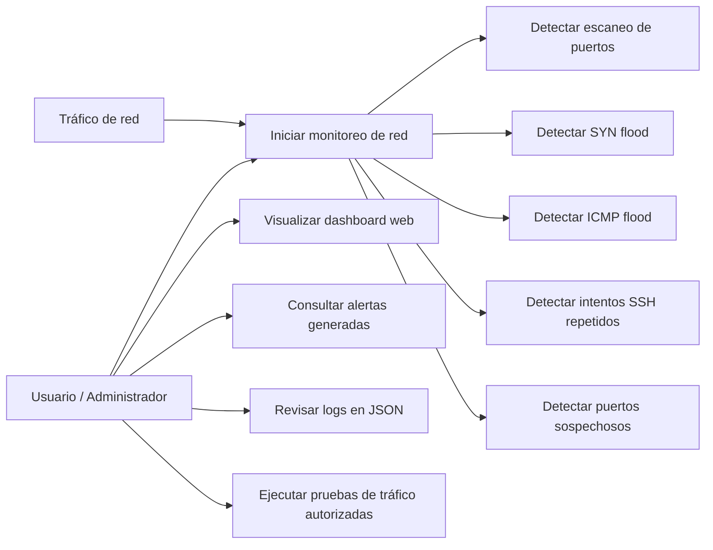

## 3.2 Vista lógica

La vista lógica refleja la descomposición del sistema en subsistemas y sus colaboraciones internas.

### 3.2.1 Diagrama de sub-sistemas (paquetes)

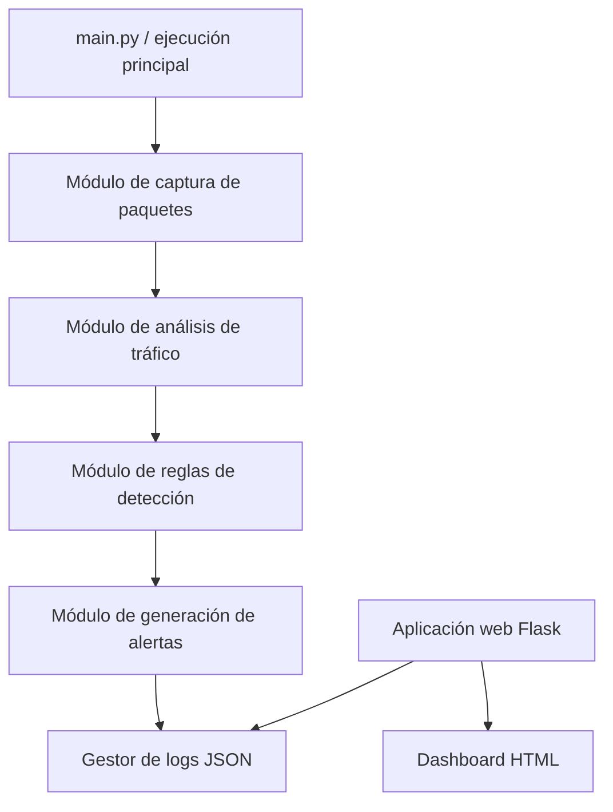

### 3.2.2 Diagrama de secuencia (vista de diseño)

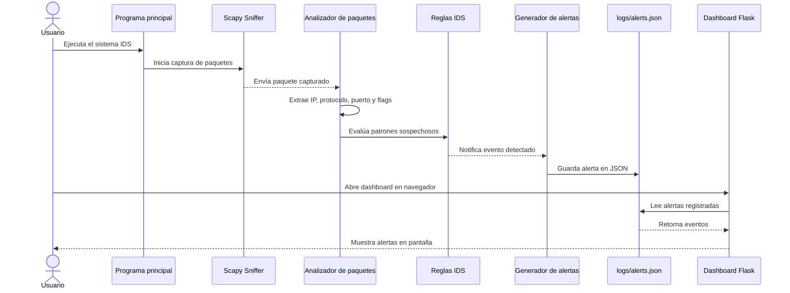

### 3.2.3 Diagrama de colaboración (vista de diseño)

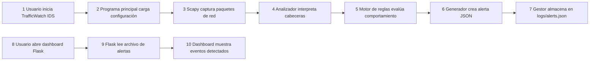

### 3.2.4 Diagrama de objetos

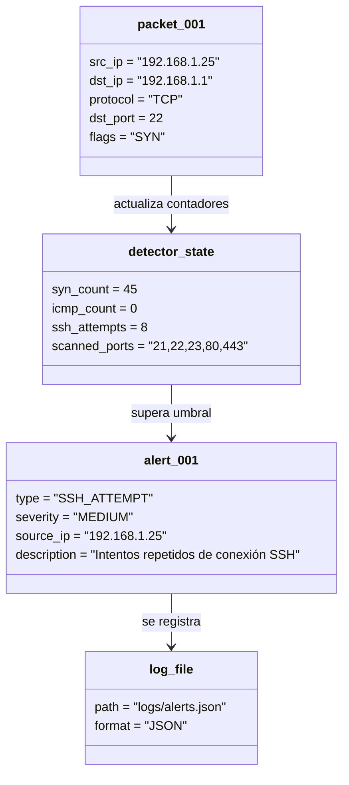

### 3.2.5 Diagrama de clases

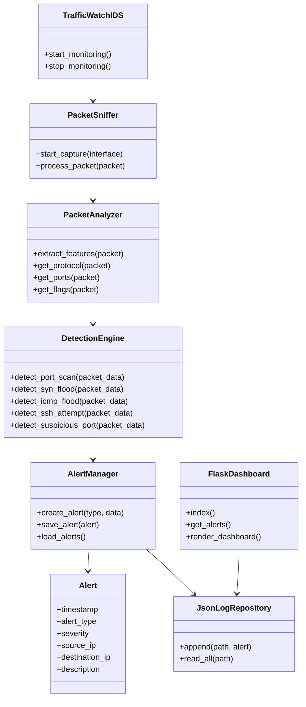

### 3.2.6 Diagrama de base de datos

El sistema no utiliza una base de datos relacional. La persistencia se realiza mediante un archivo JSON donde se almacenan las alertas generadas durante la ejecución del IDS.

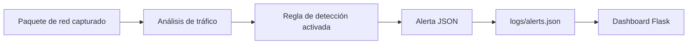

Estructura referencial de una alerta:

```json
{
  "timestamp": "2026-04-29 10:15:30",
  "alert_type": "PORT_SCAN",
  "severity": "HIGH",
  "source_ip": "192.168.1.25",
  "destination_ip": "192.168.1.1",
  "protocol": "TCP",
  "destination_port": 80,
  "description": "Posible escaneo de puertos detectado"
}
```

## 3.3 Vista de implementación (vista de desarrollo)

Describe cómo el diseño lógico se materializa en componentes de código y capas de responsabilidad.

### 3.3.1 Diagrama de arquitectura de software

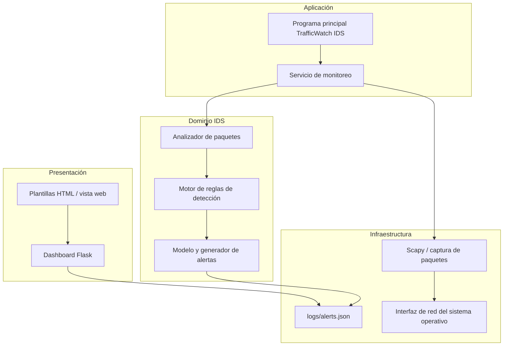

### 3.3.2 Diagrama de arquitectura del sistema (diagrama de componentes)

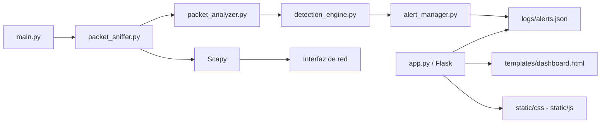

> Nota: Los nombres de archivos pueden ajustarse a la estructura real del repositorio. La arquitectura se mantiene válida mientras existan responsabilidades equivalentes para captura, análisis, detección, alertas, logs y dashboard.

## 3.4 Vista de procesos

Modela la coordinación de tareas durante la ejecución del sistema, desde la captura de paquetes hasta la visualización de alertas.

### 3.4.1 Diagrama de procesos del sistema (diagrama de actividades)

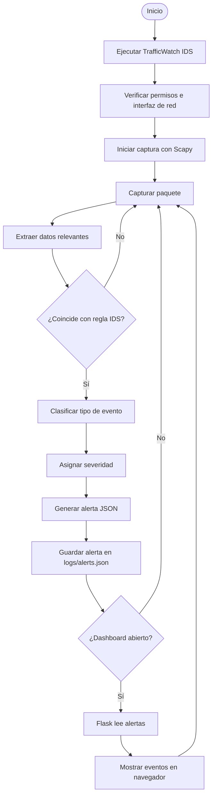

## 3.5 Vista de despliegue

Presenta el escenario de ejecución del sistema en un entorno local o de laboratorio.

### 3.5.1 Diagrama de despliegue

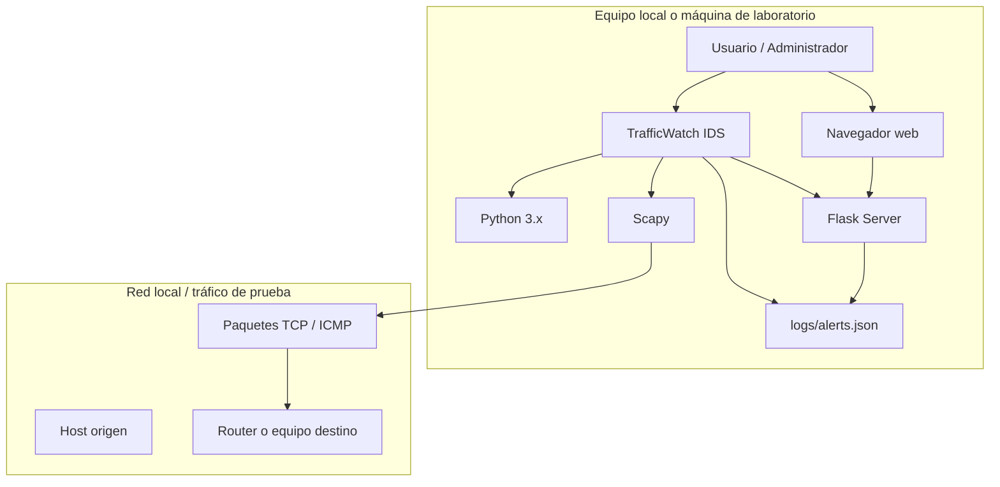

# 4. Atributos de calidad del software

## 4.1 Escenario de funcionalidad

| Elemento | Definición |
|----------|------------|
| Fuente de estímulo | Usuario o tráfico de red generado en laboratorio. |
| Estímulo | Se produce tráfico normal o sospechoso, como `ping`, escaneo de puertos o múltiples intentos de conexión. |
| Entorno | Equipo local con Python, Scapy, Flask y permisos de captura de red. |
| Respuesta | El sistema captura paquetes, analiza patrones y genera alertas cuando detecta comportamiento sospechoso. |
| Medida de respuesta | Las alertas generadas deben corresponder con los eventos definidos en los requerimientos funcionales del FD03. |

## 4.2 Escenario de usabilidad

| Elemento | Definición |
|----------|------------|
| Fuente de estímulo | Usuario académico, estudiante o evaluador del proyecto. |
| Estímulo | Necesita revisar las alertas detectadas sin analizar manualmente el archivo JSON. |
| Entorno | Navegador web conectado al dashboard Flask local. |
| Respuesta | El sistema muestra las alertas de forma comprensible, incluyendo tipo de evento, IP origen, severidad, fecha y descripción. |
| Medida de respuesta | El usuario debe poder identificar rápidamente qué evento fue detectado y desde qué IP se originó. |

## 4.3 Escenario de confiabilidad

| Elemento | Definición |
|----------|------------|
| Fuente de estímulo | Error de captura, permisos insuficientes, archivo de logs inexistente o paquete no procesable. |
| Estímulo | El sistema encuentra una condición inesperada durante la ejecución. |
| Entorno | Ejecución local en Windows o Linux. |
| Respuesta | El sistema debe manejar el error de forma controlada, evitando cierres inesperados cuando sea posible. |
| Medida de respuesta | El sistema informa el problema o continúa funcionando si el error no afecta el monitoreo principal. |

## 4.4 Escenario de rendimiento

| Elemento | Definición |
|----------|------------|
| Fuente de estímulo | Generación de tráfico de red normal o tráfico de prueba autorizado. |
| Estímulo | El sistema recibe múltiples paquetes en un intervalo corto de tiempo. |
| Entorno | Red local o entorno de laboratorio. |
| Respuesta | El sistema procesa los paquetes y actualiza sus contadores de detección sin retrasos significativos para el escenario académico. |
| Medida de respuesta | Procesamiento cercano al tiempo real en pruebas controladas de baja o mediana carga. |

## 4.5 Escenario de mantenibilidad

| Elemento | Definición |
|----------|------------|
| Fuente de estímulo | El equipo de desarrollo requiere agregar una nueva regla de detección. |
| Estímulo | Se desea detectar otro patrón sospechoso, como tráfico hacia un nuevo puerto o comportamiento anómalo adicional. |
| Entorno | Código Python organizado por responsabilidades. |
| Respuesta | La nueva regla se incorpora en el módulo de detección sin modificar de forma extensa la captura, el dashboard o la persistencia. |
| Medida de respuesta | Bajo acoplamiento entre captura, análisis, reglas, alertas y visualización. |

## 4.6 Otros escenarios de calidad

### 4.6.1 Seguridad

| Elemento | Definición |
|----------|------------|
| Fuente de estímulo | Usuario ejecuta el IDS en una red de laboratorio. |
| Estímulo | El sistema captura tráfico para identificar comportamientos sospechosos. |
| Entorno | Equipo local con permisos de captura. |
| Respuesta | El sistema se limita a analizar tráfico y generar alertas, sin alterar paquetes ni bloquear conexiones. |
| Medida de respuesta | Cumplimiento del alcance IDS: detección y alerta, sin acciones preventivas automáticas. |

### 4.6.2 Auditabilidad

| Elemento | Definición |
|----------|------------|
| Fuente de estímulo | Evaluador o usuario requiere revisar eventos detectados previamente. |
| Estímulo | Se consulta el archivo de alertas generado por el sistema. |
| Entorno | Archivo `logs/alerts.json` disponible en el proyecto. |
| Respuesta | El sistema conserva registros en formato JSON con datos básicos del evento. |
| Medida de respuesta | Cada alerta debe incluir fecha, tipo, severidad, IP origen, IP destino y descripción. |

### 4.6.3 Portabilidad

| Elemento | Definición |
|----------|------------|
| Fuente de estímulo | Usuario desea ejecutar el sistema en Windows o Linux. |
| Estímulo | Se instala Python y las dependencias necesarias. |
| Entorno | Sistema operativo compatible con Python, Scapy y Flask. |
| Respuesta | El sistema puede ejecutarse con ajustes mínimos, considerando permisos de captura de red. |
| Medida de respuesta | Instalación y ejecución reproducible en entornos académicos controlados. |
