**UNIVERSIDAD PRIVADA DE TACNA**

**FACULTAD DE INGENIERÍA**

**Escuela Profesional de Ingeniería de Sistemas**

**Proyecto *TrafficWatch IDS***

Curso: *Calidad y Pruebas de Software*

Docente: *Patrick Cuadros Quiroga*

Integrantes:

***Edgar Diego Chara Apaza        (2019065026)***  
***Abel Fernando Pacompía Ortiz   (2023076797)***

**Tacna – Perú**

***2026***

\pagebreak

Sistema *Desarrollo de un sistema de detección de intrusos (IDS) para monitoreo de tráfico de red*

Informe de Arquitectura de Software

Versión *1.0*

| CONTROL DE VERSIONES |           |              |               |            |                 |
|:--------------------:|:----------|:-------------|:--------------|:-----------|:----------------|
|       Versión        | Hecha por | Revisada por | Aprobada por  | Fecha      | Motivo          |
|         1.0          | APO, ECA  | APO, ECA     | P. Cuadros Q. | 2026-04-29 | Versión inicial |

# ÍNDICE GENERAL

1. [Introducción](#1-introducción)
    1. [Propósito (Diagrama 4+1)](#11-propósito-diagrama-41)
    2. [Alcance](#12-alcance)
    3. [Definiciones, siglas y abreviaturas](#13-definiciones-siglas-y-abreviaturas)
    4. [Organización del documento](#14-organización-del-documento)
2. [Objetivos y restricciones arquitectónicas](#2-objetivos-y-restricciones-arquitectónicas)
    1. [Priorización de requerimientos](#21-priorización-de-requerimientos)
        1. [Requerimientos funcionales](#211-requerimientos-funcionales)
        2. [Requerimientos no funcionales](#212-requerimientos-no-funcionales)
    2. [Restricciones arquitectónicas](#22-restricciones-arquitectónicas)
3. [Representación de la arquitectura del sistema](#3-representación-de-la-arquitectura-del-sistema)
    1. [Vista de uso](#31-vista-de-uso)
        1. [Diagrama de casos de uso](#311-diagrama-de-casos-de-uso)
    2. [Vista lógica](#32-vista-lógica)
        1. [Diagrama de sub-sistemas (paquetes)](#321-diagrama-de-sub-sistemas-paquetes)
        2. [Diagrama de secuencia (vista de diseño)](#322-diagrama-de-secuencia-vista-de-diseño)
        3. [Diagrama de colaboración (vista de diseño)](#323-diagrama-de-colaboración-vista-de-diseño)
        4. [Diagrama de objetos](#324-diagrama-de-objetos)
        5. [Diagrama de clases](#325-diagrama-de-clases)
        6. [Diagrama de base de datos](#326-diagrama-de-base-de-datos)
    3. [Vista de implementación (vista de desarrollo)](#33-vista-de-implementación-vista-de-desarrollo)
        1. [Diagrama de arquitectura de software](#331-diagrama-de-arquitectura-de-software)
        2. [Diagrama de arquitectura del sistema (diagrama de componentes)](#332-diagrama-de-arquitectura-del-sistema-diagrama-de-componentes)
    4. [Vista de procesos](#34-vista-de-procesos)
        1. [Diagrama de procesos del sistema (diagrama de actividades)](#341-diagrama-de-procesos-del-sistema-diagrama-de-actividades)
    5. [Vista de despliegue](#35-vista-de-despliegue)
        1. [Diagrama de despliegue](#351-diagrama-de-despliegue)
4. [Atributos de calidad del software](#4-atributos-de-calidad-del-software)
    1. [Escenario de funcionalidad](#41-escenario-de-funcionalidad)
    2. [Escenario de usabilidad](#42-escenario-de-usabilidad)
    3. [Escenario de confiabilidad](#43-escenario-de-confiabilidad)
    4. [Escenario de rendimiento](#44-escenario-de-rendimiento)
    5. [Escenario de mantenibilidad](#45-escenario-de-mantenibilidad)
    6. [Otros escenarios de calidad](#46-otros-escenarios-de-calidad)

\pagebreak

# 1. Introducción

## 1.1 Propósito (Diagrama 4+1)

Este informe describe la arquitectura de software de *JavaDepAnalyzer* siguiendo el enfoque 4+1, articulando las vistas
de uso, lógica, implementación, procesos y despliegue, y vinculándolas con los requerimientos establecidos en FD03 y las
restricciones de FD01/FD02.

Las decisiones de arquitectura priorizan:

- Cobertura funcional del análisis de dependencias Java (Maven/Gradle).
- Seguridad operativa en la actualización de versiones (confirmación explícita y backup).
- Interoperabilidad para CI/CD (salida JSON y códigos de salida).
- Mantenibilidad mediante separación modular del código.

## 1.2 Alcance

Este documento cubre la arquitectura del sistema implementado en la versión actual del proyecto, incluyendo:

- Flujo de análisis (`analyze`) y visualización interactiva (`tui`).
- Flujo de remediación guiada (`update`) con `--dry-run` y respaldo `.bak`.
- Integración con OSS Index y enriquecimiento opcional con NVD (`--use-nvd`).
- Estructura de paquetes, componentes y comunicación interna.

No se incluye una arquitectura de aplicación web o móvil, ni persistencia basada en una base de datos relacional, porque
el producto es una herramienta CLI/TUI local orientada a archivos y APIs externas.

## 1.3 Definiciones, siglas y abreviaturas

| Término   | Definición                                                                 |
|-----------|----------------------------------------------------------------------------|
| API       | Interfaz de programación de aplicaciones para comunicación entre sistemas. |
| CI/CD     | Integración continua y entrega continua.                                   |
| CLI       | Interfaz de línea de comandos.                                             |
| CVE       | Identificador estándar de vulnerabilidad conocida.                         |
| CVSS      | Métrica estándar para severidad de vulnerabilidades.                       |
| FD01      | Informe de Factibilidad.                                                   |
| FD02      | Informe de Visión.                                                         |
| FD03      | Informe de Especificación de Requerimientos.                               |
| JSON      | Formato de intercambio de datos estructurados.                             |
| NVD       | National Vulnerability Database de NIST.                                   |
| OSS Index | Servicio de Sonatype para consulta de vulnerabilidades.                    |
| RF        | Requerimiento funcional.                                                   |
| RNF       | Requerimiento no funcional.                                                |
| SCA       | Software Composition Analysis.                                             |
| TUI       | Interfaz de usuario en terminal (modo pantalla completa).                  |

## 1.4 Organización del documento

- Sección 2: presenta objetivos arquitectónicos y priorización de requerimientos.
- Sección 3: documenta las vistas arquitectónicas con diagramas Mermaid.
- Sección 4: define escenarios de atributos de calidad con criterios verificables.

# 2. Objetivos y restricciones arquitectónicas

## 2.1 Priorización de requerimientos

### 2.1.1 Requerimientos funcionales

| ID    | Descripción                                                               | Prioridad |
|-------|---------------------------------------------------------------------------|-----------|
| RF-01 | Detectar tipo de proyecto (`pom.xml`, `build.gradle`, `build.gradle.kts`) | Alta      |
| RF-02 | Parsear dependencias y repositorios por formato                           | Alta      |
| RF-03 | Consultar última versión en repositorios configurados                     | Alta      |
| RF-04 | Detectar CVEs con OSS Index                                               | Alta      |
| RF-05 | Enriquecer CVEs con NVD de forma opcional                                 | Media     |
| RF-06 | Clasificar vulnerabilidades directas y transitivas                        | Alta      |
| RF-07 | Renderizar salida legible en consola                                      | Alta      |
| RF-08 | Exportar salida JSON estable                                              | Alta      |
| RF-09 | Proveer interfaz TUI interactiva                                          | Media     |
| RF-10 | Actualización guiada con confirmación y backup                            | Alta      |
| RF-11 | Simulación de actualización (`--dry-run`)                                 | Media     |
| RF-12 | Fallar en CI por CVE crítico (`--fail-on-critical`)                       | Media     |

### 2.1.2 Requerimientos no funcionales

| ID     | Descripción                                         | Prioridad |
|--------|-----------------------------------------------------|-----------|
| RNF-01 | Portabilidad en Windows, Linux y macOS              | Alta      |
| RNF-02 | Usabilidad técnica y ayuda clara en CLI             | Alta      |
| RNF-03 | Confiabilidad ante fallas de red/APIs               | Alta      |
| RNF-04 | Seguridad de credenciales de repositorios           | Alta      |
| RNF-05 | Interoperabilidad mediante JSON y códigos de salida | Alta      |
| RNF-06 | Rendimiento razonable en proyectos medianos         | Media     |
| RNF-07 | Mantenibilidad por arquitectura modular             | Alta      |
| RNF-08 | Auditabilidad mediante CI/CD y pruebas              | Media     |

## 2.2 Restricciones arquitectónicas

| Restricción                                  | Implicancia de diseño                                                          |
|----------------------------------------------|--------------------------------------------------------------------------------|
| JDK 25+ y Kotlin 2.3.10                      | La arquitectura se basa en JVM moderna y toolchain Gradle actual.              |
| Herramienta local CLI/TUI                    | No se diseña backend web ni frontend web dedicado.                             |
| Dependencia de APIs externas (OSS Index/NVD) | Se requiere estrategia de degradación controlada ante errores o rate limit.    |
| Sin base de datos relacional                 | Persistencia orientada a archivos (`build`, `.bak`, `dependency-report.json`). |
| Actualización no destructiva                 | Confirmación explícita y backup obligatorio antes de aplicar cambios.          |
| Soporte multi-build (Maven/Gradle)           | Se separan parsers y updaters por tipo de proyecto.                            |
| Integración CI                               | Se define salida JSON y modo fail-on-critical para automatización.             |

# 3. Representación de la arquitectura del sistema

## 3.1 Vista de uso

Esta vista muestra cómo los actores interactúan con las capacidades centrales del sistema.

### 3.1.1 Diagrama de casos de uso

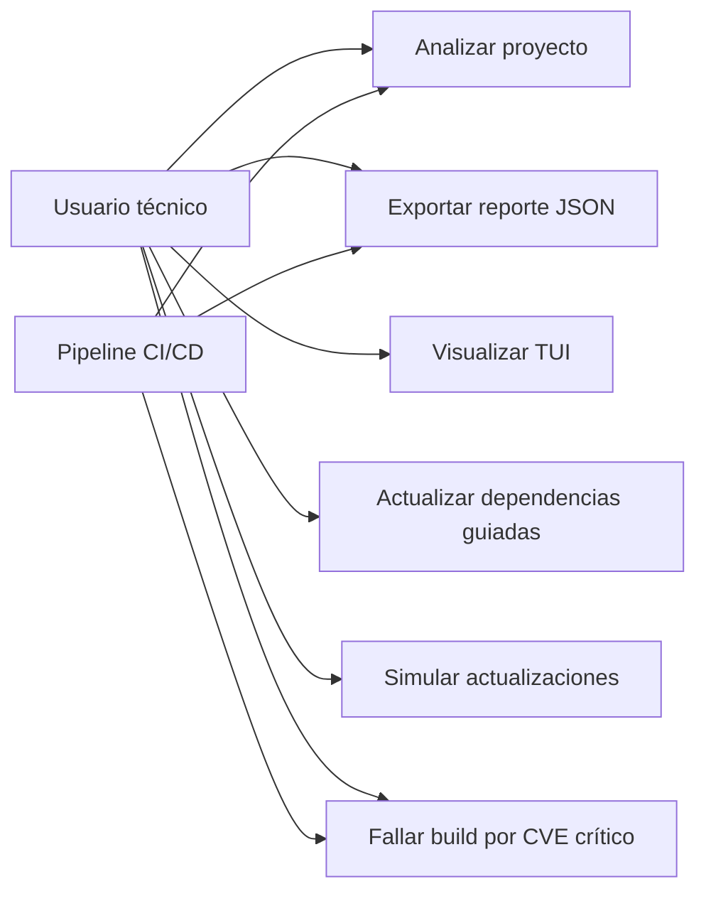

## 3.2 Vista lógica

La vista lógica refleja la descomposición del sistema en subsistemas y sus colaboraciones.

### 3.2.1 Diagrama de sub-sistemas (paquetes)

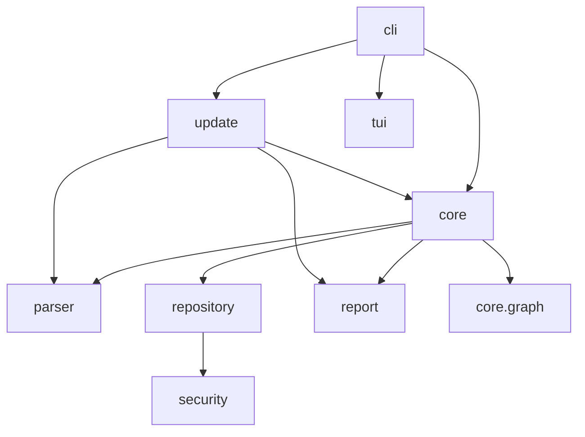

### 3.2.2 Diagrama de secuencia (vista de diseño)

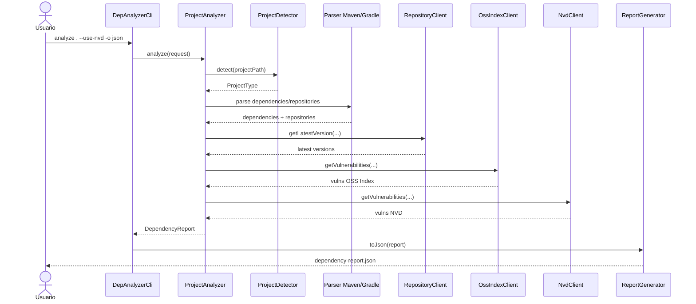

### 3.2.3 Diagrama de colaboración (vista de diseño)

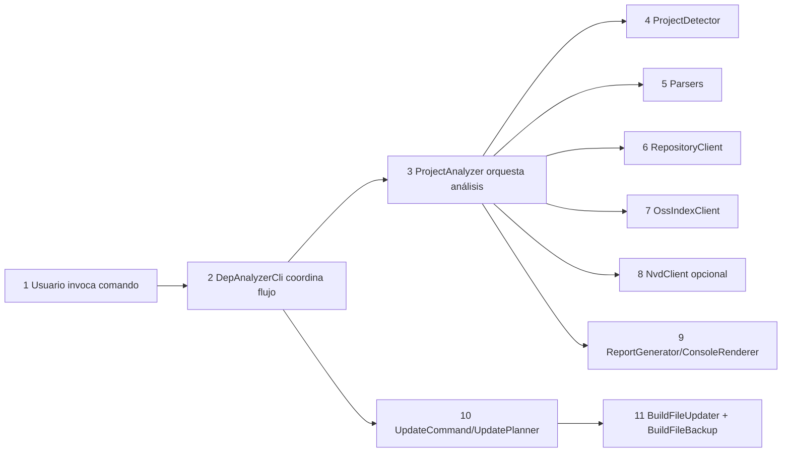

### 3.2.4 Diagrama de objetos

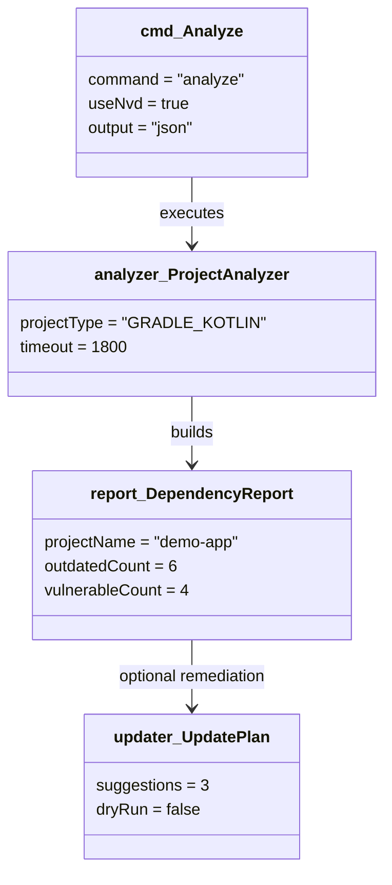

### 3.2.5 Diagrama de clases

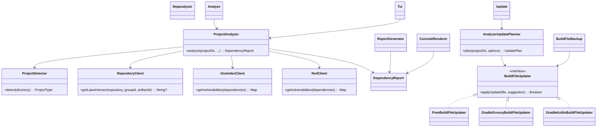

### 3.2.6 Diagrama de base de datos

El sistema no utiliza una base de datos relacional. El almacenamiento se realiza sobre archivos del proyecto analizado y
salidas generadas por la herramienta.

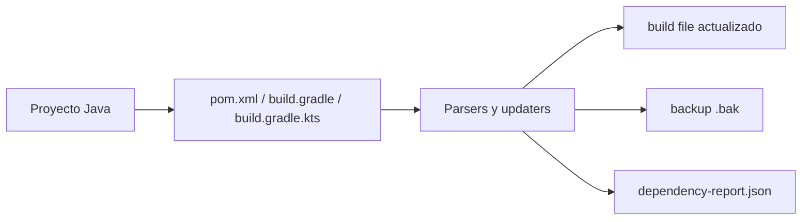

## 3.3 Vista de implementación (vista de desarrollo)

Describe cómo el diseño lógico se materializa en componentes de código y capas de responsabilidad.

### 3.3.1 Diagrama de arquitectura de software

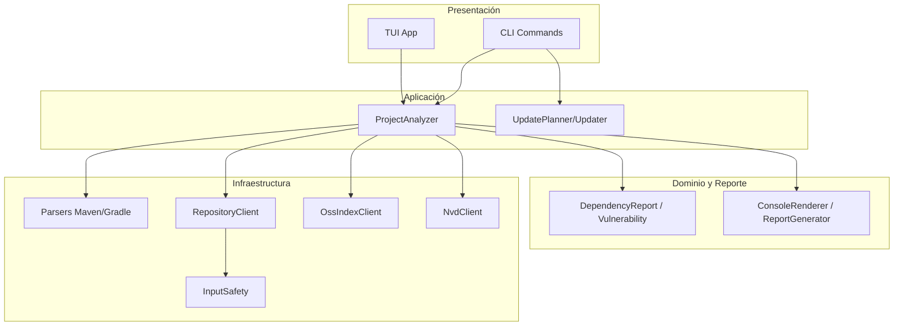

### 3.3.2 Diagrama de arquitectura del sistema (diagrama de componentes)

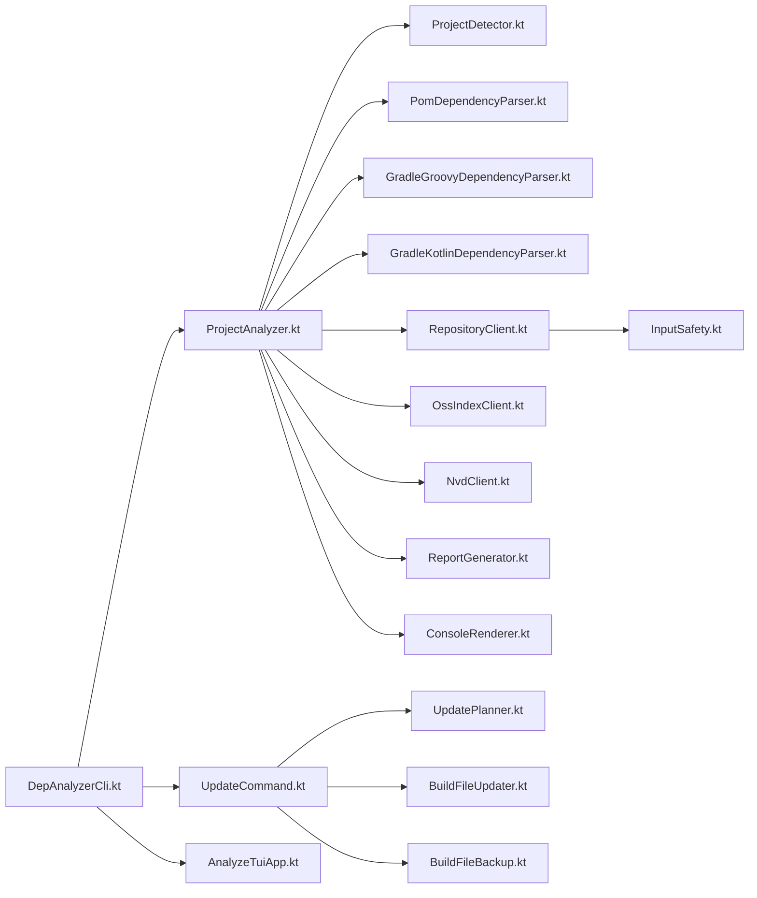

## 3.4 Vista de procesos

Modela la coordinación de tareas en ejecución, incluyendo escenarios de degradación por fallas externas.

### 3.4.1 Diagrama de procesos del sistema (diagrama de actividades)

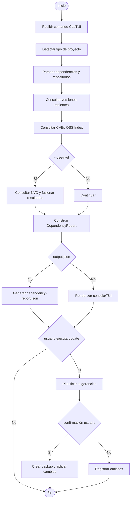

## 3.5 Vista de despliegue

Presenta escenarios de ejecución física del sistema en local y en CI.

### 3.5.1 Diagrama de despliegue

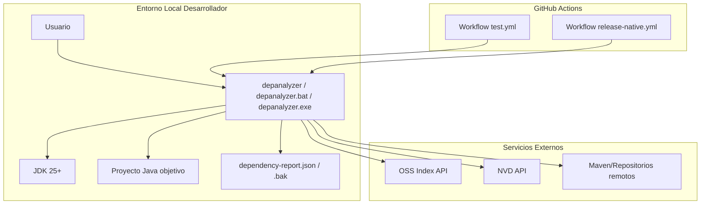

# 4. Atributos de calidad del software

## 4.1 Escenario de funcionalidad

| Elemento            | Definición                                                               |
|---------------------|--------------------------------------------------------------------------|
| Fuente de estímulo  | Usuario técnico o pipeline CI                                            |
| Estímulo            | Ejecutar análisis sobre un proyecto Maven/Gradle                         |
| Entorno             | CLI local o runner CI con conectividad de red                            |
| Respuesta           | Detectar tipo de proyecto, listar desactualizadas y CVEs, emitir reporte |
| Medida de respuesta | Cobertura funcional alineada con RF priorizados de FD03                  |

## 4.2 Escenario de usabilidad

| Elemento            | Definición                                                                |
|---------------------|---------------------------------------------------------------------------|
| Fuente de estímulo  | Usuario técnico básico/intermedio                                         |
| Estímulo            | Necesita interpretar hallazgos y tomar decisiones de actualización        |
| Entorno             | Terminal local con o sin soporte de color                                 |
| Respuesta           | CLI con ayuda consistente, salida legible, modo TUI y opción `--no-color` |
| Medida de respuesta | Comprensión operativa de salida >= 80% en evaluación interna (FD02)       |

## 4.3 Escenario de confiabilidad

| Elemento            | Definición                                                                          |
|---------------------|-------------------------------------------------------------------------------------|
| Fuente de estímulo  | Fallo de red, error de API externa o rate limiting                                  |
| Estímulo            | Error HTTP/timeout en OSS Index o NVD                                               |
| Entorno             | Ejecución normal de análisis                                                        |
| Respuesta           | Degradación controlada: continuar análisis con información disponible y advertencia |
| Medida de respuesta | Ejecución no aborta por falla parcial externa en escenarios manejables              |

## 4.4 Escenario de rendimiento

| Elemento            | Definición                                                        |
|---------------------|-------------------------------------------------------------------|
| Fuente de estímulo  | Usuario ejecuta análisis en proyecto mediano                      |
| Estímulo            | Consulta de dependencias, versiones y CVEs                        |
| Entorno             | Equipo local de referencia (FD01)                                 |
| Respuesta           | Completar análisis con tiempos operables para ciclo de desarrollo |
| Medida de respuesta | Objetivo referencial <= 30 s en caso pequeño/mediano (FD02/FD03)  |

## 4.5 Escenario de mantenibilidad

| Elemento            | Definición                                                                    |
|---------------------|-------------------------------------------------------------------------------|
| Fuente de estímulo  | Equipo de desarrollo requiere agregar parser o nueva fuente de vulnerabilidad |
| Estímulo            | Cambio evolutivo en módulo específico                                         |
| Entorno             | Código Kotlin modular con pruebas                                             |
| Respuesta           | Modificación acotada por paquete sin impacto transversal no controlado        |
| Medida de respuesta | Bajo acoplamiento entre `parser`, `repository`, `core`, `report`, `update`    |

## 4.6 Otros escenarios de calidad

### 4.6.1 Seguridad

| Elemento            | Definición                                                      |
|---------------------|-----------------------------------------------------------------|
| Fuente de estímulo  | Proyecto con repositorios privados y credenciales               |
| Estímulo            | Consulta de metadatos de versión con autenticación              |
| Entorno             | Ejecución local con variable de confianza de hosts              |
| Respuesta           | Enviar credenciales solo a hosts HTTPS permitidos por allowlist |
| Medida de respuesta | Cumplimiento de política `DEPANALYZER_TRUSTED_CREDENTIAL_HOSTS` |

### 4.6.2 Interoperabilidad

| Elemento            | Definición                                                          |
|---------------------|---------------------------------------------------------------------|
| Fuente de estímulo  | Pipeline CI/CD                                                      |
| Estímulo            | Consumir resultado de análisis en etapa automatizada                |
| Entorno             | GitHub Actions u otro motor CI                                      |
| Respuesta           | Salida JSON parseable y `--fail-on-critical` para control de estado |
| Medida de respuesta | Integración estable de reporte y política de fallo por criticidad   |
