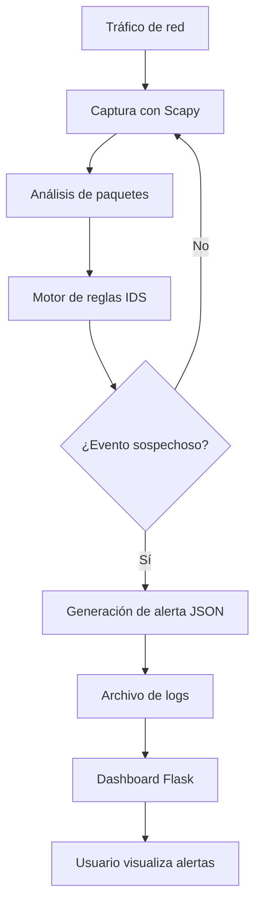

<center>

**UNIVERSIDAD PRIVADA DE TACNA**

**FACULTAD DE INGENIERÍA**

**Escuela Profesional de Ingeniería de Sistemas**

# Informe Final

## Proyecto *TrafficWatch IDS*

Curso: *CALIDAD Y PRUEBAS DE SOFTWARE*

Docente: *MAG. PATRICK CUADROS QUIROGA*

Integrantes:

***Edgar Diego Chara Apaza        (2019065026)***  
***Abel Fernando Pacompía Ortiz   (2023076797)***

**Tacna – Perú**

***2026***

</center>

<div style="page-break-after: always; visibility: hidden">\pagebreak</div>

# CONTROL DE VERSIONES

| Versión | Hecha por | Revisada por | Aprobada por | Fecha      | Motivo |
|:------:|:---------:|:------------:|:------------:|:----------:|:-------|
| 1.0    | APO, ECA  | APO, ECA     | P. Cuadros Q. | 2026-05-01 | Versión inicial del informe final del proyecto TrafficWatch IDS |
| 1.1    | APO, ECA  | APO, ECA     | P. Cuadros Q. | 2026-05-01 | Actualización del informe final con base en FD01 y FD02 |

# ÍNDICE GENERAL

1. [Antecedentes](#1-antecedentes)  
2. [Planteamiento del Problema](#2-planteamiento-del-problema)  
   2.1 [Problema](#21-problema)  
   2.2 [Justificación](#22-justificación)  
   2.3 [Alcance](#23-alcance)  
3. [Objetivos](#3-objetivos)  
   3.1 [Objetivo general](#31-objetivo-general)  
   3.2 [Objetivos específicos](#32-objetivos-específicos)  
4. [Marco Teórico](#4-marco-teórico)  
5. [Desarrollo de la Solución](#5-desarrollo-de-la-solución)  
   5.1 [Análisis de Factibilidad](#51-análisis-de-factibilidad)  
   5.2 [Tecnología de Desarrollo](#52-tecnología-de-desarrollo)  
   5.3 [Metodología de Implementación](#53-metodología-de-implementación)  
   5.4 [Arquitectura general de la solución](#54-arquitectura-general-de-la-solución)  
   5.5 [Pruebas realizadas](#55-pruebas-realizadas)  
6. [Cronograma](#6-cronograma)  
7. [Presupuesto](#7-presupuesto)  
8. [Conclusiones](#8-conclusiones)  
9. [Recomendaciones](#9-recomendaciones)  
10. [Bibliografía](#10-bibliografía)  
11. [Webgrafía](#11-webgrafía)  
12. [Anexos](#12-anexos)  

<div style="page-break-after: always; visibility: hidden">\pagebreak</div>

# 1. Antecedentes

El crecimiento del uso de redes informáticas en entornos académicos, empresariales y personales ha incrementado la necesidad de contar con mecanismos de monitoreo que permitan detectar actividades sospechosas. En redes pequeñas o educativas, muchas veces no existen herramientas accesibles que permitan identificar eventos como escaneos de puertos, intentos repetidos de conexión, tráfico inusual o posibles ataques de denegación de servicio.

En el marco del curso **Calidad y Pruebas de Software**, se desarrolló el proyecto **TrafficWatch IDS**, denominado formalmente como *Desarrollo de un sistema básico de detección de intrusos (IDS) para monitoreo de tráfico de red*. El proyecto tiene una duración estimada de cuatro semanas y se orienta a un entorno académico controlado.

TrafficWatch IDS se plantea como una herramienta básica de detección de intrusos que permite capturar tráfico de red, analizar paquetes mediante reglas simples y generar alertas ante comportamientos sospechosos. Su finalidad principal es académica y formativa, ya que permite integrar conocimientos de redes, ciberseguridad, programación, arquitectura de software y pruebas.

El sistema utiliza tecnologías de código abierto como **Python**, **Scapy**, **Flask**, **Git**, **GitHub** y **Visual Studio Code**, lo cual permite reducir costos y facilitar su implementación en equipos personales o entornos de laboratorio.

# 2. Planteamiento del Problema

## 2.1 Problema

Actualmente, muchas redes locales no cuentan con mecanismos eficientes para detectar intrusiones o actividades sospechosas en tiempo real. Esta situación permite que ciertos comportamientos anómalos pasen desapercibidos, como escaneo de puertos, intentos de acceso repetidos, tráfico ICMP excesivo o conexiones hacia puertos poco comunes.

En instituciones académicas, entidades pequeñas o redes de laboratorio, las soluciones comerciales de ciberseguridad pueden resultar costosas o demasiado complejas. Además, la ausencia de herramientas de monitoreo limita el aprendizaje práctico sobre seguridad informática y dificulta la aplicación de pruebas de software en escenarios reales o simulados.

Por ello, se identifica la necesidad de desarrollar un sistema básico de detección de intrusos que permita monitorear tráfico de red, aplicar reglas simples de detección y generar alertas oportunas para su revisión.

## 2.2 Justificación

El desarrollo de TrafficWatch IDS se justifica porque permite atender una necesidad técnica y académica: contar con una herramienta accesible para monitorear tráfico de red y detectar comportamientos sospechosos en un entorno controlado.

Desde el punto de vista académico, el proyecto permite aplicar los documentos del ciclo de desarrollo trabajados en el curso: informe de factibilidad, documento de visión, especificación de requerimientos, informe de arquitectura e informe final. Además, permite evidenciar criterios de calidad mediante pruebas funcionales, validación de alertas, revisión de logs y evaluación de la arquitectura.

Desde el punto de vista técnico, el uso de Python y Scapy permite capturar y analizar paquetes de red, mientras que Flask facilita la creación de un dashboard web para visualizar alertas. El almacenamiento en formato JSON permite conservar registros de eventos sin requerir una base de datos compleja.

## 2.3 Alcance

El alcance del proyecto comprende el desarrollo de un sistema IDS básico con las siguientes capacidades:

- Captura de paquetes de red en tiempo real.
- Análisis de paquetes mediante reglas simples.
- Detección de escaneo de puertos.
- Detección de posibles ataques SYN flood.
- Detección de posibles ataques ICMP flood.
- Detección de intentos repetidos de conexión SSH.
- Detección de tráfico hacia puertos sospechosos.
- Generación de alertas clasificadas por nivel de riesgo.
- Registro de alertas en archivos de log.
- Visualización de eventos mediante una interfaz web básica con Flask.
- Validación del sistema mediante pruebas funcionales e integración.

El sistema no incluye bloqueo automático de tráfico, integración con firewall, mitigación activa de ataques ni operación en entornos empresariales de alta demanda. Por tanto, TrafficWatch IDS debe considerarse un **IDS**, no un **IPS**.

# 3. Objetivos

## 3.1 Objetivo general

Desarrollar un sistema básico de detección de intrusos capaz de monitorear tráfico de red y generar alertas ante posibles actividades sospechosas, aplicando buenas prácticas de calidad, arquitectura y pruebas de software.

## 3.2 Objetivos específicos

- Implementar un módulo de captura de paquetes de red en tiempo real mediante librerías especializadas.
- Desarrollar un sistema de análisis basado en reglas para identificar patrones de tráfico sospechoso.
- Detectar comportamientos anómalos como escaneo de puertos, SYN flood, ICMP flood, intentos de acceso repetidos y tráfico hacia puertos sospechosos.
- Generar alertas clasificadas según el nivel de riesgo detectado.
- Registrar los eventos detectados en archivos de log para su revisión posterior.
- Implementar un dashboard web básico para visualizar las alertas generadas.
- Validar el sistema mediante pruebas funcionales e integración.
- Documentar el proyecto de acuerdo con la estructura académica solicitada.

# 4. Marco Teórico

## 4.1 Sistema de detección de intrusos

Un sistema de detección de intrusos, conocido como IDS, es una herramienta diseñada para monitorear eventos dentro de una red o sistema informático con el fin de identificar posibles actividades sospechosas. Su función principal es detectar y alertar. A diferencia de un IPS, un IDS no bloquea automáticamente el tráfico ni modifica reglas de seguridad.

TrafficWatch IDS se ubica dentro de esta categoría porque analiza tráfico de red y genera alertas, pero no ejecuta acciones de mitigación automática.

## 4.2 Tráfico de red

El tráfico de red está compuesto por paquetes que circulan entre dispositivos. Cada paquete puede contener datos técnicos como dirección IP de origen, dirección IP de destino, protocolo, puerto de origen, puerto de destino y banderas de control. El análisis de estos datos permite reconocer comportamientos normales o sospechosos.

## 4.3 Escaneo de puertos

El escaneo de puertos consiste en realizar múltiples intentos de conexión hacia diferentes puertos de un equipo para identificar servicios activos. Puede ser utilizado con fines administrativos, pero también como fase previa a un ataque. Por ello, el IDS debe detectar cuando una misma IP intenta acceder a diversos puertos en un periodo corto.

## 4.4 SYN flood

El SYN flood es un comportamiento asociado al envío elevado de paquetes TCP con bandera SYN. Este patrón puede estar relacionado con ataques de denegación de servicio. En TrafficWatch IDS, se puede detectar mediante conteos o umbrales de paquetes SYN provenientes de una misma fuente.

## 4.5 ICMP flood

El ICMP flood consiste en el envío repetitivo de paquetes ICMP, comúnmente asociados a pruebas tipo `ping`. Si el volumen de paquetes supera un umbral determinado, puede considerarse un evento sospechoso.

## 4.6 Intentos repetidos SSH

SSH es un protocolo de administración remota segura, generalmente asociado al puerto 22. Múltiples intentos de conexión hacia este puerto pueden representar una conducta sospechosa, especialmente si se originan desde la misma dirección IP.

## 4.7 Python, Scapy y Flask

Python es el lenguaje principal del proyecto por su facilidad de uso y amplia disponibilidad de librerías. Scapy permite capturar, inspeccionar y manipular paquetes de red. Flask permite desarrollar una interfaz web ligera para visualizar los eventos detectados.

## 4.8 Calidad y pruebas de software

La calidad de software se relaciona con la capacidad de un sistema para cumplir sus requerimientos de manera correcta, mantenible, confiable y verificable. En TrafficWatch IDS, la calidad se trabaja mediante requerimientos claros, arquitectura modular, control de versiones, pruebas funcionales y validación de alertas.

# 5. Desarrollo de la Solución

## 5.1 Análisis de Factibilidad

### 5.1.1 Factibilidad técnica

El proyecto es técnicamente factible porque utiliza herramientas accesibles, documentadas y de código abierto. Python permite implementar la lógica principal, Scapy facilita la captura y análisis de paquetes, y Flask permite desarrollar una interfaz web básica. El sistema puede ejecutarse en Windows o Linux, aunque Linux resulta recomendable para pruebas de captura de tráfico.

Los requisitos técnicos mínimos considerados son: procesador Intel Core i3 o equivalente, 4 GB de RAM como mínimo, almacenamiento disponible, tarjeta de red compatible y conectividad LAN o Wi-Fi.

### 5.1.2 Factibilidad económica

El proyecto es económicamente viable porque no requiere licencias comerciales. Las herramientas utilizadas son gratuitas y open-source. El costo total estimado del desarrollo, considerando materiales, servicios básicos y trabajo del equipo, asciende a **S/. 2025.00**.

### 5.1.3 Factibilidad operativa

El sistema puede ser operado por estudiantes o usuarios con conocimientos básicos de redes. Su ejecución se realiza en un entorno académico controlado, con supervisión docente y sin afectar redes institucionales reales. El mantenimiento estará a cargo de los desarrolladores durante la fase de prueba.

### 5.1.4 Factibilidad legal

El proyecto es legalmente viable porque utiliza software de código abierto y se limita a entornos autorizados. No se debe usar el sistema para monitorear redes de terceros sin autorización. El análisis se orienta a datos técnicos como IPs, puertos y protocolos, evitando el almacenamiento de información personal sensible.

### 5.1.5 Factibilidad social

El proyecto tiene impacto social positivo al fortalecer el aprendizaje en ciberseguridad, fomentar la cultura de seguridad informática y promover el desarrollo de soluciones tecnológicas accesibles.

### 5.1.6 Factibilidad ambiental

El impacto ambiental es mínimo, ya que se trata de un proyecto de software distribuido digitalmente, sin procesos industriales ni uso significativo de materiales físicos.

## 5.2 Tecnología de Desarrollo

| Tecnología | Uso dentro del proyecto |
|-----------|--------------------------|
| Python 3 | Lenguaje principal de desarrollo. |
| Scapy | Captura y análisis de paquetes de red. |
| Flask | Dashboard web para visualización de alertas. |
| Socket | Manejo básico de comunicación de red cuando corresponde. |
| JSON | Registro estructurado de alertas. |
| Visual Studio Code | Entorno de desarrollo. |
| Git | Control de versiones local. |
| GitHub | Repositorio remoto, colaboración y gestión del proyecto. |
| GitHub Issues | Seguimiento de tareas y actividades del desarrollo. |
| Markdown | Documentación técnica y académica. |

## 5.3 Metodología de Implementación

El proyecto se desarrolló mediante una metodología incremental. Primero se definió el problema y se elaboró el análisis de factibilidad. Luego se formuló la visión del producto, estableciendo interesados, usuarios, alcance, capacidades y restricciones. Posteriormente se definieron los requerimientos del sistema y se diseñó la arquitectura de software.

La implementación se organizó por módulos: captura de tráfico, análisis de paquetes, reglas de detección, generación de alertas, almacenamiento de logs y visualización en dashboard. Finalmente, se realizaron pruebas funcionales y de integración básica para validar el comportamiento del IDS.

Los documentos académicos asociados son:

- FD01: Informe de Factibilidad.
- FD02: Documento de Visión.
- FD03: Especificación de Requerimientos de Software.
- FD04: Informe de Arquitectura de Software.
- FD05: Informe Final del Proyecto.

## 5.4 Arquitectura general de la solución



## 5.5 Pruebas realizadas

| Prueba | Descripción | Resultado esperado |
|-------|-------------|-------------------|
| Captura de tráfico | Verificar que el sistema capture paquetes de red. | El sistema recibe paquetes para análisis. |
| Detección de escaneo de puertos | Simular múltiples conexiones hacia distintos puertos. | Se genera alerta de posible escaneo. |
| Detección de SYN flood | Generar múltiples paquetes TCP SYN en un entorno controlado. | Se genera alerta al superar el umbral. |
| Detección de ICMP flood | Generar múltiples paquetes ICMP tipo `ping`. | Se genera alerta si el tráfico supera el umbral definido. |
| Detección de SSH repetido | Realizar intentos hacia el puerto 22. | Se genera alerta de intentos repetidos SSH. |
| Registro de eventos | Revisar que las alertas se almacenen correctamente. | El archivo de logs conserva los datos del evento. |
| Visualización web | Abrir el dashboard Flask. | Las alertas registradas se muestran al usuario. |

## 5.6 Consideraciones sobre GitHub Actions, Docker y pruebas E2E

El proyecto puede integrarse con GitHub Actions para pruebas automatizadas de sintaxis, instalación de dependencias y validación de módulos. Sin embargo, la captura real de tráfico con Scapy debe validarse preferentemente en un entorno local o de laboratorio, debido a las limitaciones de red y permisos en los runners de CI/CD.

La dockerización puede aplicarse principalmente al dashboard Flask y a pruebas controladas. No obstante, la captura real de paquetes desde Docker requiere permisos especiales, como capacidades de red o configuración específica del contenedor.

Respecto a pruebas end-to-end, el proyecto permite diseñar pruebas que validen el flujo completo desde la generación de tráfico hasta el registro y visualización de alertas. Si estas pruebas no se encuentran implementadas en el repositorio, deben considerarse una mejora futura.

# 6. Cronograma

El proyecto tiene una duración estimada de **4 semanas**.

| Actividad | Semana 1 | Semana 2 | Semana 3 | Semana 4 |
|----------|:--------:|:--------:|:--------:|:--------:|
| Definición del problema y alcance | X |  |  |  |
| Elaboración del FD01 - Factibilidad | X |  |  |  |
| Elaboración del FD02 - Visión | X | X |  |  |
| Definición de requerimientos FD03 |  | X |  |  |
| Diseño de arquitectura FD04 |  | X | X |  |
| Implementación de captura con Scapy |  | X | X |  |
| Implementación de reglas IDS |  |  | X |  |
| Generación de alertas y logs |  |  | X |  |
| Implementación de dashboard Flask |  |  | X | X |
| Pruebas funcionales e integración |  |  |  | X |
| Elaboración de informe final FD05 |  |  |  | X |

# 7. Presupuesto

## 7.1 Costos generales

| Ítem | Descripción | Cantidad | Costo Unitario (S/.) | Costo Total (S/.) |
|------|-------------|---------:|---------------------:|------------------:|
| Laptop / Computadora | Equipo de desarrollo propio | 1 | 0.00 | 0.00 |
| Cuadernos / hojas | Material para apuntes y documentación | 2 | 15.00 | 30.00 |
| Lapiceros | Material de escritura | 5 | 2.00 | 10.00 |
| Impresiones | Documentos del proyecto | 100 | 0.10 | 10.00 |
| Cartucho de tinta | Impresora | 1 | 80.00 | 80.00 |
| Marcadores | Presentaciones y esquemas | 3 | 5.00 | 15.00 |
| Internet | Servicio mensual | 1 | 80.00 | 80.00 |
| Energía eléctrica | Consumo durante desarrollo | 1 | 50.00 | 50.00 |
| **TOTAL** |  |  |  | **275.00** |

## 7.2 Costos del ambiente

| Ítem | Descripción | Cantidad | Costo Mensual (S/.) | Costo Total (S/.) |
|------|-------------|---------:|--------------------:|------------------:|
| Internet | Servicio de conexión a internet | 1 | 80.00 | 80.00 |
| Energía eléctrica | Consumo durante desarrollo | 1 | 50.00 | 50.00 |
| Agua | Consumo básico | 1 | 20.00 | 20.00 |
| Espacio de trabajo | Uso de ambiente propio | 1 | 0.00 | 0.00 |
| **TOTAL** |  |  |  | **150.00** |

## 7.3 Costos de personal

| Rol | Cantidad | Horas Totales | Costo por Hora (S/.) | Costo Total (S/.) |
|-----|---------:|--------------:|---------------------:|------------------:|
| Desarrollador 1 | 1 | 80 | 10.00 | 800.00 |
| Desarrollador 2 | 1 | 80 | 10.00 | 800.00 |
| **TOTAL** |  |  |  | **1600.00** |

## 7.4 Costos totales

| Tipo de Costo | Descripción | Costo Total (S/.) |
|---------------|-------------|------------------:|
| Costos Generales | Materiales de oficina y recursos básicos | 275.00 |
| Costos Operativos / Ambiente | Servicios básicos durante un mes | 150.00 |
| Costos de Personal | Desarrollo del sistema por dos integrantes | 1600.00 |
| **TOTAL GENERAL** |  | **2025.00** |

# 8. Conclusiones

1. El proyecto **TrafficWatch IDS** permitió desarrollar una herramienta básica de detección de intrusos orientada al monitoreo de tráfico de red en tiempo real.

2. El sistema responde a una necesidad identificada en entornos académicos y redes pequeñas: contar con una herramienta accesible para detectar comportamientos sospechosos sin depender de soluciones comerciales costosas.

3. La solución es técnicamente viable porque utiliza tecnologías open-source como Python, Scapy, Flask, GitHub y Visual Studio Code.

4. La arquitectura modular facilita el mantenimiento del sistema, separando responsabilidades de captura, análisis, reglas de detección, generación de alertas, registro de logs y visualización.

5. El sistema permite detectar eventos como escaneo de puertos, SYN flood, ICMP flood, intentos repetidos SSH y tráfico hacia puertos sospechosos.

6. El proyecto tiene factibilidad económica, operativa, legal, social y ambiental favorable, de acuerdo con el análisis realizado.

7. El sistema debe ser entendido como un IDS, ya que detecta y alerta, pero no bloquea tráfico ni mitiga ataques automáticamente.

8. El proyecto fortalece el aprendizaje práctico en redes, ciberseguridad, calidad de software, documentación técnica y pruebas.

# 9. Recomendaciones

1. Implementar una suite de pruebas automatizadas con Pytest para validar las reglas de detección de forma más precisa.

2. Incorporar pruebas de integración end-to-end que validen el flujo completo desde la generación de tráfico hasta la visualización de alertas.

3. Mejorar el dashboard Flask con filtros por tipo de alerta, IP origen, severidad y fecha.

4. Permitir que los umbrales de detección sean configurables desde un archivo externo.

5. Evaluar el uso de una base de datos ligera, como SQLite, si se requiere consultar historial de eventos de forma más avanzada.

6. Documentar claramente el proceso de instalación y ejecución en Windows y Linux.

7. Mantener el uso del sistema únicamente en redes propias, autorizadas o entornos de laboratorio.

8. Diferenciar siempre el alcance IDS del alcance IPS para evitar atribuir al sistema funciones de bloqueo que no implementa.

# 10. Bibliografía

- Sommerville, I. (2011). *Ingeniería de software* (9.ª ed.). Pearson Educación.
- Stallings, W. (2017). *Seguridad informática: principios y práctica*. Pearson.
- Kurose, J., & Ross, K. (2017). *Redes de computadoras: un enfoque descendente* (7.ª ed.). Pearson.
- Pressman, R. S. (2010). *Ingeniería del software: un enfoque práctico*. McGraw-Hill.

# 11. Webgrafía

- Python Software Foundation. (2026). *Python Documentation*. https://docs.python.org/3/
- Scapy Project. (2026). *Scapy Documentation*. https://scapy.readthedocs.io/
- Flask. (2026). *Flask Documentation*. https://flask.palletsprojects.com/
- OWASP Foundation. (2026). *Open Web Application Security Project*. https://owasp.org/
- Cisco Networking Academy. (2026). *Introducción a la Ciberseguridad*. https://www.netacad.com/
- NIST. (2026). *Guide to Intrusion Detection and Prevention Systems*. https://nvlpubs.nist.gov/nistpubs/Legacy/SP/nistspecialpublication800-94.pdf
- IBM Security. (2026). *What is an Intrusion Detection System?*. https://www.ibm.com/topics/intrusion-detection-system

# 12. Anexos

## Anexo 01. Informe de Factibilidad

Corresponde al documento **FD01 - Informe de Factibilidad**, donde se analiza la viabilidad técnica, económica, operativa, legal, social y ambiental del proyecto TrafficWatch IDS.

## Anexo 02. Documento de Visión

Corresponde al documento **FD02 - Informe de Visión**, donde se define el propósito, alcance, interesados, usuarios, características, restricciones y prioridades del producto.

## Anexo 03. Documento SRS

Corresponde al documento **FD03 - Especificación de Requerimientos de Software**, donde se detallan los requerimientos funcionales y no funcionales del sistema.

## Anexo 04. Documento SAD

Corresponde al documento **FD04 - Informe de Arquitectura de Software**, donde se describe la arquitectura del sistema mediante vistas, componentes, procesos y atributos de calidad.

## Anexo 05. Manuales y otros documentos

Incluye manuales de instalación, ejecución, evidencias de pruebas, capturas del dashboard, estructura del repositorio y documentación complementaria.

## Anexo 06. Repositorio del proyecto

Repositorio GitHub del proyecto:

```text
https://github.com/UPT-FAING-EPIS/proyecto-si784-2026-i-u1-ids.git
```

